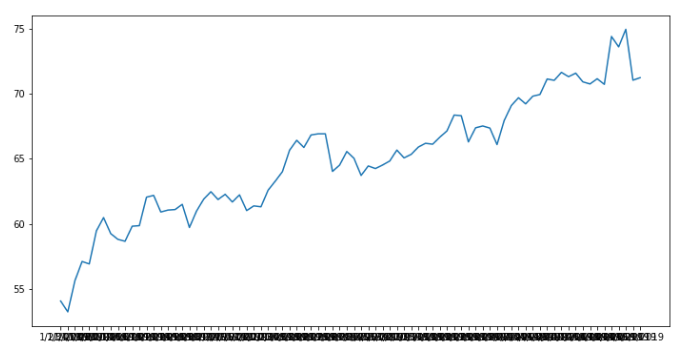
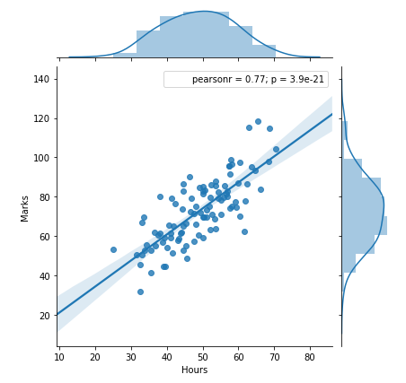
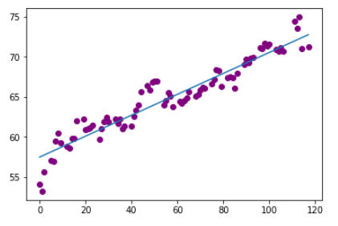

# OilPrice Prediction
The goal of this repo is to build a model that predicts the Oil price using simple Linear Regression. It is useful for finding the relationship between two continuous variables. One is predictor or independent variable and other is response or dependent variable. Plot the best fit line and predict the oil price and same will be verified using R-squared metrices.

# Problem Statement
Oil price in the international market fluctuates everyday. Many industry that rely on oil as input. Certainly, this model helps the downstream companies to predict the oil price if given the date and invest accordingly.

# DataSource
Europe Brent and WTI (Western Texas Intermediate) Spot Prices (Annual/ Monthly/ Weekly/ Daily) from EIA U.S. (Energy Information Administration). Europe Brent Spot Price FOB (Dollars per Barrel) data available from 20 May 1987 till today. However, I have considered 2019 data till April. Primarily, excel data has "Date" & "Price" (Daily). https://www.eia.gov/dnav/pet/hist/RBRTEd.htm

# Data Profiling
While doing the analysis, noticed that the data does not have any null values and found to be valid. 
However, always been a challenge especially when plotting the date series. It requires series of conversions, which helps to plot the data.

1. Set the index to Date field
2. Convert Index to a DateTimeIndex
3. Convert DateTiemIndex to Day elapsed
4. Plot the Time series data

# Assumptions of LR
####  1. Linear relationship:
  From the below graphs, it is observed that the positive, strong co-relation between dependent and independent variable. 
  
  
  
#### 2. Normal Distribution
 It is inferred from the below graph, that the data is normally distrinuted.
  
 

Hence, it satisfies the assumptions of Linear Regression.

# Split Data - Train & Test
Dataset has been split into Train & Test. Model learn the train data and find the best fit model with the below co-efficient & Intercept.
Co-efficient : 0.13058265
Intercept    : 57.47706099989631
and the linear score found to be 0.90596790465424, which means the 91% accuracy.

 

# Manually Evaluate the Model 

57.47706099989632 + 0.13058265*117 (ie 2019-04-29)

# Evaluate the Predicting vs Actual
Predicting : 72.75 # From the above model 
Actual     : 71.22 # Actual Data 

# Conclusion
Coefficient of the prediction shows the 0.905 ie 91% accuracy.
For Instance, Oil Price on 2019-04-29 is 71.22, where as the model predicted as 72.75
